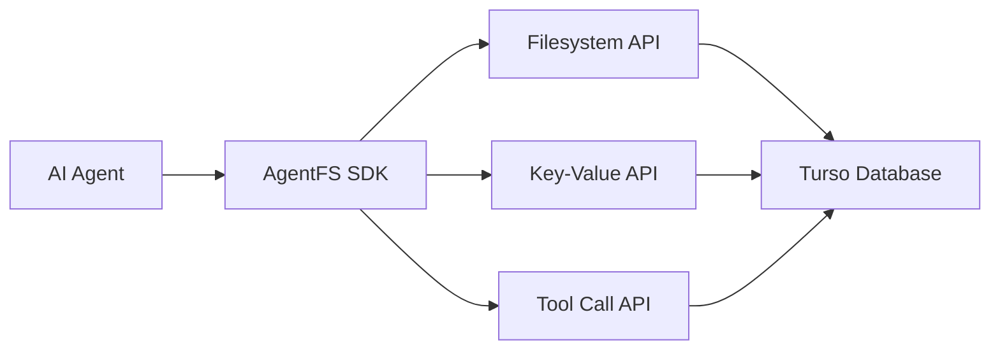

AgentFS is a specialized filesystem and state management SDK designed for AI agents. It provides a complete, queryable, and portable solution for managing agent state, files, and interactions—all powered by Turso's embedded database technology.

## Why AgentFS?

Building reliable AI agents requires solving fundamental challenges:

- **State Management**: Agents need persistent memory across sessions
- **Auditability**: Every action must be traceable for debugging and compliance
- **Reproducibility**: Agent states must be snapshottable and restorable
- **Simplicity**: Complex distributed systems shouldn't be required for agent development

AgentFS solves these challenges with a single, portable database file that contains your entire agent runtime.

## Key Features

<CardGroup cols={2}>
  <Card title="Virtual Filesystem" icon="folder">
    POSIX-like file and directory operations for agent data management
  </Card>
  <Card title="Key-Value Store" icon="database">
    Fast, typed storage for agent state and configuration
  </Card>
  <Card title="Tool Call Tracking" icon="list-check">
    Automatic audit logging of all agent tool invocations
  </Card>
  <Card title="Single File Storage" icon="file">
    Entire agent runtime in one portable Turso database
  </Card>
</CardGroup>

## Core Capabilities

### 🗄️ Unified Storage
Everything your agent needs—files, state, history—stored in a single database file. No complex infrastructure, just one file you can query, backup, or move.

### 🔍 Built-in Auditability
Every filesystem operation, state change, and tool call is automatically recorded. Query your agent's behavior with SQL:

```sql
-- Find all web searches performed by the agent
SELECT * FROM toolcalls
WHERE name = 'web_search'
ORDER BY timestamp DESC;

-- Analyze file modifications
SELECT * FROM events
WHERE type = 'file_write'
AND timestamp > datetime('now', '-1 hour');
```

### 🔄 State Reproducibility
Snapshot agent states at any point and restore them later. Perfect for:
- Debugging complex agent behaviors
- Testing different execution paths
- Creating checkpoints in long-running workflows

### 📦 Portability
Move your entire agent between environments with a single file. Development to production, cloud to edge—your agent's complete state travels with it.

## Architecture

AgentFS provides three main interfaces:



All operations are atomic and transactional, ensuring data consistency even during failures.

## Quick Example

```typescript
import { AgentFS } from 'agentfs-sdk';

// Open or create an agent filesystem
const agent = await AgentFS.open(
  './my-agent.db'
);

// Store agent configuration
await agent.kv.set('agent:config', {
  model: 'gpt-4',
  temperature: 0.7,
  maxTokens: 2000
});

// Write generated content
await agent.fs.writeFile(
  '/outputs/report.md',
  reportContent
);

// Track tool usage
await agent.tools.record(
  'generate_report',
  startTime,
  endTime,
  { topic: 'Q4 Analysis' },
  { success: true, pages: 15 }
);

// Query the agent's work
const recentFiles = await agent.fs.readdir('/outputs');
const toolHistory = await agent.tools.list({ limit: 10 });
```

## Use Cases

<CardGroup cols={2}>
  <Card title="Development & Testing" icon="code">
    Develop agents locally with full state persistence and debugging capabilities
  </Card>
  <Card title="Production Deployment" icon="rocket">
    Deploy agents with built-in logging, monitoring, and state management
  </Card>
  <Card title="Compliance & Auditing" icon="shield">
    Track every agent action for regulatory compliance and accountability
  </Card>
  <Card title="Multi-Agent Systems" icon="users">
    Share state between agents or maintain isolation with separate databases
  </Card>
</CardGroup>

## Getting Started

Ready to build more reliable AI agents? Start with our quickstart guide:

<Card title="AgentFS Quickstart" icon="play" href="/agentfs/quickstart">
  Set up AgentFS and build your first stateful agent in minutes
</Card>

## Available SDKs

<CardGroup cols={3}>
  <Card title="TypeScript" icon="js" href="/agentfs/sdk/typescript">
    Full-featured SDK for Node.js and browser environments
  </Card>
  <Card title="Rust" icon="rust" href="/agentfs/sdk/rust">
    High-performance native SDK with async support
  </Card>
  <Card title="Python" icon="python">
    Coming soon - Python SDK for data science and ML workflows
  </Card>
</CardGroup>

## Learn More

- [Blog: Introducing AgentFS](https://turso.tech/blog/agentfs) - Deep dive into why we built AgentFS
- [Blog: AgentFS FUSE](https://turso.tech/blog/agentfs-fuse) - Mount AgentFS as a native filesystem
- [GitHub Repository](https://github.com/tursodatabase/agentfs) - Source code and examples

<Warning>
AgentFS is currently in ALPHA. We recommend using it for development and testing only. The API may change as we gather feedback from the community.
</Warning>