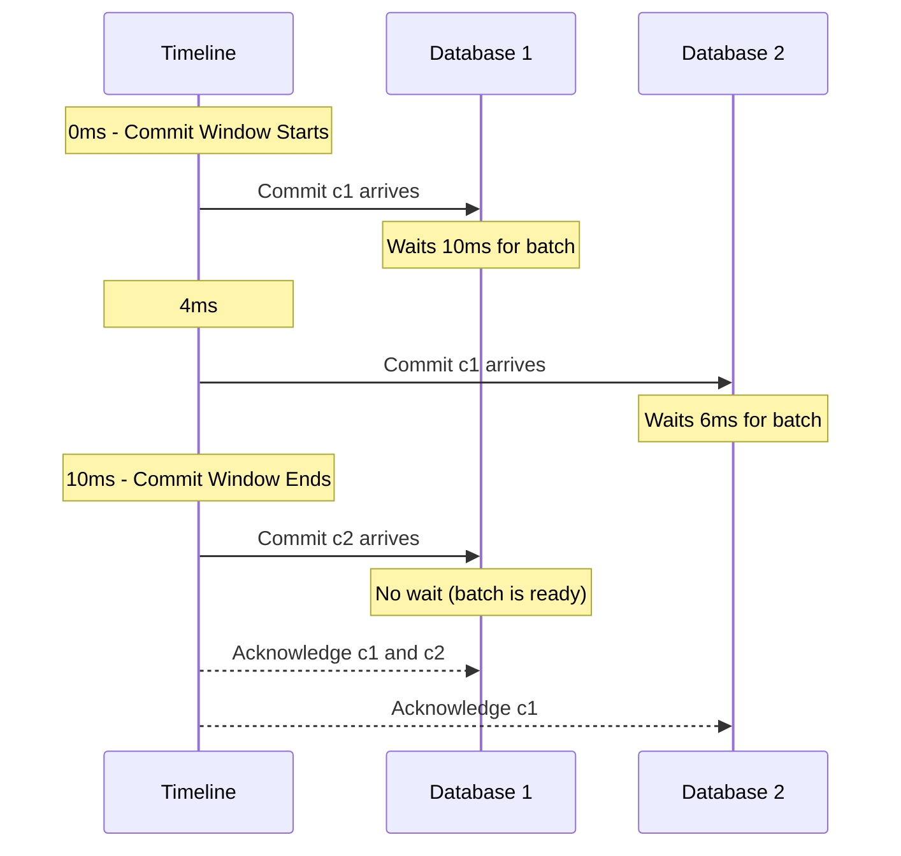

The following are the durability guarantees provided by the Turso Cloud platform for users who registered or upgraded **after March 17, 2025**:

|                   | Durability    | Added commit latency |
| ----------------- | ------------- | -------------------- |
| **Free**          | 99.999999999% | up to 100ms          |
| **Developer**     | 99.999999999% | up to 50ms           |
| **Scaler**        | 99.999999999% | up to 25ms           |
| **Pro and above** | 99.999999999% | up to 10ms           |

For all Turso AWS regions, we employ a diskless architecture where data is backed by a combination of S3-Express One Zone and S3.

Commits are only acknowledged once data is safely stored in either S3 or S3-express. Compute nodes can come and go at any time, and local disks act as a local cache. Therefore, we can provide the same durability guarantees as AWS’s best-in-class S3 storage.

<Note>
  Pro and Enterprise customers can use their own S3 / S3-express buckets,
  guaranteeing that data lives inside their infrastructure. In our future
  roadmap, compute will also be runnable inside your account, for a full BYOC
  solution
</Note>

## Short term and long term guarantees

Any SQLite-compatible database has mainly two storage components: The Write-Ahead Log, or WAL, which contains the most recent commits, and the database file. Periodically, the data in the WAL is folded back into the main database file.

New commits to the database that are sent to the Turso Cloud are stored in S3-express One Zone before they are acknowledged to the application. Periodically, the data is folded back into the main database file and stored on S3. As per AWS service agreement, both technologies provide a 99.999999999% durability guarantee.

## Commit latency

One of the reasons why an S3-based architecture is not as popular for transactional workloads as it is for analytical workloads is the high cost of writing to object store. Due to Turso Cloud’s multi-tenant architecture, commits are batched across many databases to amortize this cost.

Furthermore, commits are also batched in time, that is the added commit latency as described in Table 1.

The commit latency is not the expected latency in every commit, but the ceiling of added latency in each commit.

To understand how this works, let's consider the following scenario:

Let's break it down:

- The first commit (c1) to database d1 that happens at the beginning of the 10ms commit window must wait the full 10ms
- The commit (c1) to database d2 that happens 4ms into the window only waits the remaining 6ms
- The second commit (c2) to database d1 that arrives exactly at the end of the commit window has no added latency

## Testing methodology

Turso Cloud server is written from the ground up to use Deterministic Simulation Testing. DST, for short, is a technique that automatically tests the code across a variety of possible, randomly generated inputs, and upon any failure generates a seed that deterministically reproduces the issue with all its preconditions.

In addition to our simulator, we rely on [Antithesis](https://antithesis.com) full-system Deterministic Simulation Hypervisor to test the interaction of the system with external components, like AWS S3 and S3-Express One Zone.

The combination of our ground-up DST server and Antithesis allows us to test years of possible combinations of unlikely scenarios over the course of mere hours, making sure the system works as specified.
