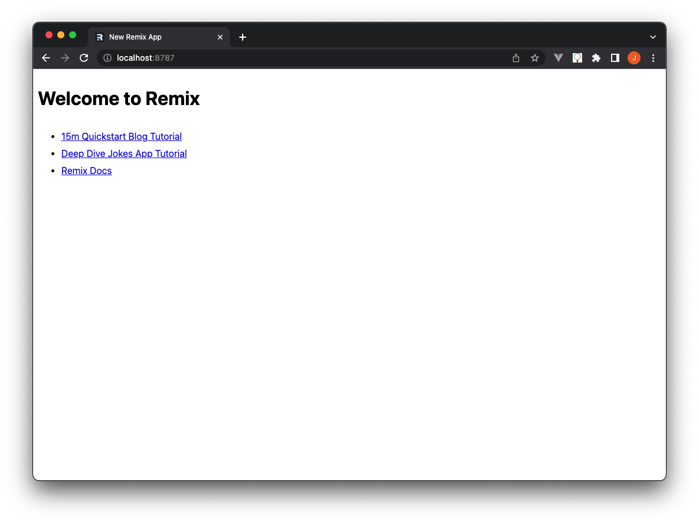
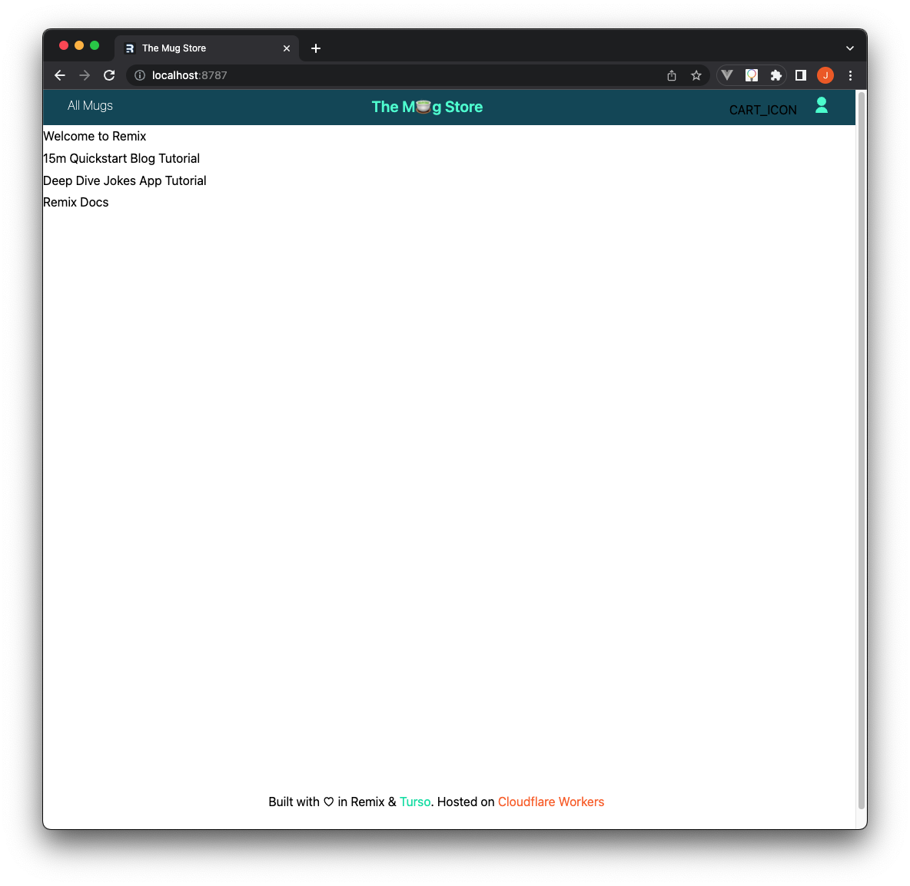

# Step 1: Setting up the project

Before getting started, make sure that you satify the following pre-requisites:

- You need the latest [LTS version of Node.js] to work with node packages.
- The [Turso CLI installed] in your system to create databases.
- [A Cloudflare account] and wrangler installed to deploy the website.

Here’s what the e-commerce store we are building will look like when completed.


## Creating a Remix app

Create a new Remix app by running the following command on your terminal.

```sh
npx create-remix@latest the-mug-store
```

When prompted for the "type of app" you want to create, choose "Just the
basics", choose "Cloudflare workers" as where you want to deploy the app, and
"TypeScript" as the language to use while creating the app.

On completion, the above command should create a new Remix app with the
following directory tree.

```sh title="Remix project directory structure"
├── README.md
├── app
│   ├── entry.client.tsx
│   ├── entry.server.tsx
│   ├── root.tsx
│   └── routes
│       └── _index.tsx
├── package.json
├── public
│   └── favicon.ico
├── remix.config.js
├── remix.env.d.ts
├── server.ts
├── tsconfig.json
└── wrangler.toml
```

Here is a gist of some of the above files and what they do:

- `entry.client.tsx`: This is the browser’s entry point which is also
  responsible for hydrating the markup generated by the server.
- `entry.server.tsx`: This is where Remix handles the generation of the HTTP
  responses for the app.
- `remix.config.js`: This file contains some build and development configuration
  options. It does not run on the server.
- `root.tsx`: This file is the principal layout file of the Remix app.
- `wrangler.toml`: This is the Cloudflare wrangler project configuration file.

`cd` into the project and run `npm install` to install the project’s
dependencies. Next, run `npm run dev` to deploy and preview the Remix app
locally. You should see the following. (If any missing dependency errors are
thrown at you, just install them and run `npm run dev` once more)



Since we are going to use TailwindCSS to style the website, follow [the steps
provided here] to set that up. Use this [Tailwind configuration file] and run
the following command to install some Tailwind dependencies.

```sh
npm i -D @tailwindcss/forms @tailwindcss/typography
```

Restart the dev server to proceed.

## Setting up the UI

Add the site’s navigation header and footer by creating two components
`Footer.tsx` and `Header.tsx` under a `app/components` directory. Add the
following code to these two components.

```tsx title="/app/components/Footer.tsx"
export const Footer = () => {
  return (
    <footer className="flex justify-center py-12">
      <span>
        Built with ♡ in{" "}
        <a
          href="https://remix.run/"
          target="_blank"
          className=""
          rel="noreferrer"
        >
          Remix
        </a>{" "}
        &{" "}
        <a
          href="https://turso.tech/"
          target="_blank"
          className="text-secondary-500"
          rel="noreferrer"
        >
          Turso
        </a>
        {". Hosted on "}
        <a
          href="https://developers.cloudflare.com/workers/"
          target="_blank"
          className="text-orange-500"
          rel="noreferrer"
        >
          Cloudflare Workers
        </a>
      </span>
    </footer>
  );
};
```

```tsx title="/app/components/Header.tsx"
export const Header = () => {
  return (
    <header className="header flex justify-between px-4 py-2 bg-primary">
      <ul className="flex justify-start">
        <li>
          <a
            href="/mugs"
            className="text-white font-thin hover:text-secondary-300"
          >
            {" "}
            All Mugs{" "}
          </a>
        </li>
      </ul>
      <div className={`logo`}>
        <a
          href="/"
          title="Turix Store"
          className="font-semibold text-center text-white no-decoration"
        >
          <span className="text-secondary-300 font-semibold text-center text-xl">
            The M🍵g Store
          </span>
        </a>
      </div>
      <ul className="space-x-1">
        <li>CART_ICON</li>
        <li>
          <a href="/account/dashboard" title="account">
            <AccountIcon color="#4ff8d2" />
          </a>
        </li>
      </ul>
    </header>
  );
};
```

Next, update the app’s layout `app/root.tsx`, adding these two components to it
by replacing the `<Outlet/>` component with the following markup.

```tsx title="/app/root.tsx"
<div className="page">
  <main className="flex flex-col flex-grow min-h-[90vh]">
    <Header />
    <Outlet />
  </main>
  <div className="section dark">
    <div className="container">
      <Footer />
    </div>
  </div>
</div>
```

Do not forget to import the components at the top of the file.

```tsx title="/app/root.tsx"
import { Header } from "./components/Header";
import { Footer } from "./components/Footer";
```

_**Note:** Since the header component `/app/components/Header.tsx` imports a
`<Cart />` component, one we have yet to set up, use the text `CART_ICON` in its
place for now._

Add the following custom styles to the `app/tailwind.css` file.

```css title="/app/tailwind.css"
@layer base {
  .header .logo a {
    display: inline-block;
  }
  .header li a {
    @apply text-white px-4 flex space-x-1 justify-center items-center;
  }
  @media (min-width: 450px) {
    .header li {
      display: inline-block;
    }
  }
  @media (min-width: 768px) {
    .header {
      padding: 20px 70px;
    }
  }
}
```

Create an `Icon.tsx` component that will be used to house all the icons that we’ll
use within the app.

Add the following code to the component.

```tsx title="/app/components/Icon.tsx"
interface CartIconProps {
  color: string | undefined;
}

export const CartIcon = (props: CartIconProps) => (
  <svg
    xmlns="http://www.w3.org/2000/svg"
    viewBox="0 0 24 24"
    width="24"
    height="24"
  >
    <path
      d="M20.0049 22H4.00488C3.4526 22 3.00488 21.5523 3.00488 21V3C3.00488 2.44772 3.4526 2 4.00488 2H20.0049C20.5572 2 21.0049 2.44772 21.0049 3V21C21.0049 21.5523 20.5572 22 20.0049 22ZM9.00488 6H7.00488V8C7.00488 10.7614 9.24346 13 12.0049 13C14.7663 13 17.0049 10.7614 17.0049 8V6H15.0049V8C15.0049 9.65685 13.6617 11 12.0049 11C10.348 11 9.00488 9.65685 9.00488 8V6Z"
      fill={props.color}
    ></path>
  </svg>
);

export const AccountIcon = (props: CartIconProps) => (
  <svg
    xmlns="http://www.w3.org/2000/svg"
    viewBox="0 0 24 24"
    width="24"
    height="24"
  >
    <path
      d="M4 22C4 17.5817 7.58172 14 12 14C16.4183 14 20 17.5817 20 22H4ZM12 13C8.685 13 6 10.315 6 7C6 3.685 8.685 1 12 1C15.315 1 18 3.685 18 7C18 10.315 15.315 13 12 13Z"
      fill={props.color}
    ></path>
  </svg>
);

export const LoadingIcon = () => (
  <svg
    xmlns="http://www.w3.org/2000/svg"
    viewBox="0 0 24 24"
    className="animate-spin text-white w-4 h-4 fill-white"
  >
    <path d="M5.46257 4.43262C7.21556 2.91688 9.5007 2 12 2C17.5228 2 22 6.47715 22 12C22 14.1361 21.3302 16.1158 20.1892 17.7406L17 12H20C20 7.58172 16.4183 4 12 4C9.84982 4 7.89777 4.84827 6.46023 6.22842L5.46257 4.43262ZM18.5374 19.5674C16.7844 21.0831 14.4993 22 12 22C6.47715 22 2 17.5228 2 12C2 9.86386 2.66979 7.88416 3.8108 6.25944L7 12H4C4 16.4183 7.58172 20 12 20C14.1502 20 16.1022 19.1517 17.5398 17.7716L18.5374 19.5674Z"></path>
  </svg>
);

export const DeleteIcon = () => (
  <svg
    className="h-4 w-4 fill-white"
    xmlns="http://www.w3.org/2000/svg"
    viewBox="0 0 24 24"
  >
    <path d="M12.0007 10.5865L16.9504 5.63672L18.3646 7.05093L13.4149 12.0007L18.3646 16.9504L16.9504 18.3646L12.0007 13.4149L7.05093 18.3646L5.63672 16.9504L10.5865 12.0007L5.63672 7.05093L7.05093 5.63672L12.0007 10.5865Z"></path>
  </svg>
);
```

By now, this should be the app’s preview.



Trying to access the "All mugs" page on the navigation bar would take us to a
404 page since we have yet to set that page up. Before working on our pages,
let’s set up the app’s database.

[LTS version of Node.js]: https://nodejs.org/en/download
[Turso CLI installed]: /reference/turso-cli#installation
[A Cloudflare account]: https://dash.cloudflare.com/sign-up
[the steps provided here]: https://remix.run/docs/en/1.18.1/guides/styling#tailwind-css
[Tailwind configuration file]: https://github.com/turso-extended/app-the-mug-store/blob/master/tailwind.config.ts
