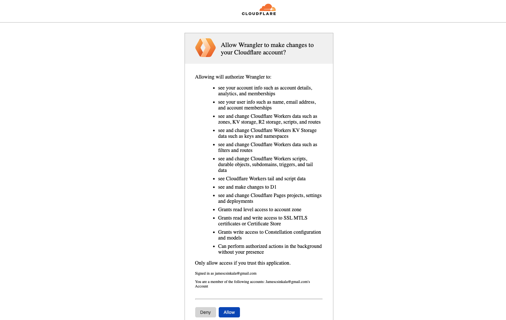

# Step 2: Setting up Turso

Proceeding to setting up a database for the app, run the following command to
create a new Turso database.

```sh
turso db create the-mug-store
```

Next, get and set up the database credentials so that the data within Turso can
be consumed by our app.

For the database url run the following command.

```sh
turso db show the-mug-store --url
```

Inside the Cloudflare wrangler configuration file `wrangler.toml` add a new
`[vars]` section and list the database url as follows.

```toml title="wrangler.toml"
[vars]
TURSO_DB_URL = "YOUR-DATABASE-URL"
```

In this section of the Cloudflare workers configuration file, we list the
environment variables that we don’t consider as sensitive within our app.

For the database auth token, run the following command.

```sh
turso db tokens create the-mug-store
```

Since the auth token is a sensitive environment variable “secret” we store it by
using the wrangler CLI, or directly on the project’s dashboard on Cloudflare.
But, to do so we first need to grant the wrangler app permissions to use our
Cloudflare account, we do that by running the `wrangler login` command.

The following tab will be opened on our browser after running the last command.



Click on “Allow” on the resulting permissions page to proceed.

Then, on the terminal run `wrangler secret put TURSO_DB_AUTH_TOKEN` , and paste
the database auth token we obtained above when prompted.

For local development, create a `.dev.vars` file at the project’s root directory
and add the `TURSO_DB_AUTH_TOKEN` key assigning it the obtained token.

```sh title=".dev.vars"
TURSO_DB_AUTH_TOKEN = "YOUR-DATABASE-TOKEN"
```

Next up, we'll be setting up Drizzle for simplified database queries within the
app.
