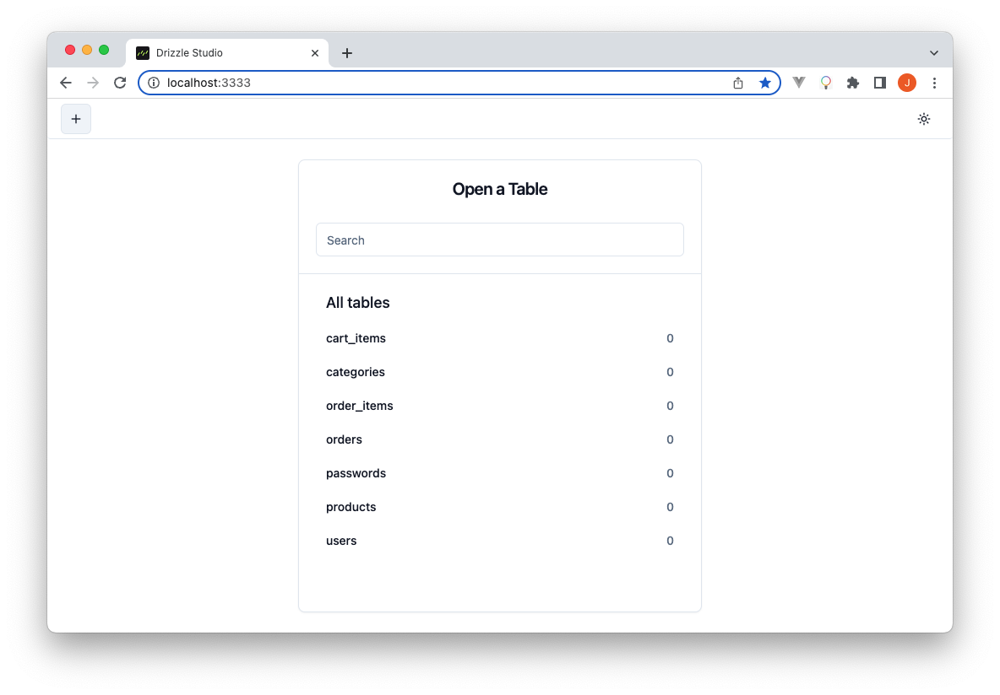

# Step 3: Configuring Drizzle

As prescribed earlier we are going to use Drizzle to handle our database schema
and build queries in our app. Run the following commands to install its
dependencies in the Remix project.

```sh
npm install drizzle-orm @libsql/client
npm install -D drizzle-kit dotenv tsx
```

_**Note:** The `dotenv` npm package added above is going to help us use
environment variables stored within the `.env` file within our Drizzle code.
We’ll use the `tsx` package to execute TypeScript files mainly within
`package.json` scripts._

Then, create a `/drizzle` directory at the project’s root.

We are going to place our app’s database schema and store Drizzle migrations
inside this directory.

Create a `.env` file at the project’s root and add the database credentials
obtained in the previous section.

```sh title=".env"
TURSO_DB_URL=<OBTAINED-TURSO-DB-URL>
TURSO_BD_AUTH_TOKEN=<OBTAINED-TURSO-DB-TOKEN>
```

_**Note:** Do not stage `.env` files to your version control systems._

Our e-commerce database is going to have the following tables.

- categories - Stores the products’ categories
- products - Stores the website’s products
- users - Stores customer information
- passwords - Stores customer passwords
- cart_items - Stores items added to cart by customers
- orders - Stores the order information created by customers
- order_items - Stores the products belonging to orders

Create a `schema.ts` file under `/drizzle` and add the following code as the
database schema.

```ts title="/drizzle/schema.ts"
import { relations, sql } from "drizzle-orm";
import {
  index,
  integer,
  real,
  sqliteTable,
  text,
  uniqueIndex,
} from "drizzle-orm/sqlite-core";

export const categories = sqliteTable(
  "categories",
  {
    id: text("id").primaryKey(),
    name: text("name"),
    image: text("image"),
  },
  (categories) => ({
    nameIdx: index("name_idx").on(categories.name),
  })
);

export const categoriesRelations = relations(categories, ({ many }) => ({
  products: many(products),
}));

export const products = sqliteTable(
  "products",
  {
    id: text("id").primaryKey(),
    name: text("name").notNull(),
    description: text("description").notNull(),
    price: real("price").notNull(),
    categoryId: integer("category_id")
      .notNull()
      .references(() => categories.id),
    image: text("image"),
    createdAt: integer("created_at").default(sql`(cast (unixepoch () as int))`),
    updatedAt: integer("updated_at").default(sql`(cast (unixepoch () as int))`),
  },
  (products) => ({
    idIdx: uniqueIndex("id_idx").on(products.id),
    priceIdx: index("price_idx").on(products.price),
    categoryIdIdx: index("category_id_idx").on(products.categoryId),
  })
);

export const productsRelations = relations(products, ({ one }) => ({
  user: one(categories, {
    fields: [products.categoryId],
    references: [categories.id],
  }),
}));

export const users = sqliteTable(
  "users",
  {
    id: text("id").primaryKey(),
    firstName: text("firstName").notNull(),
    lastName: text("lastName").notNull(),
    email: text("email").notNull(),
    address: text("address"),
    phone: text("phone"),
    avatar: text("avatar"),
    createdAt: integer("created_at").default(sql`(cast (unixepoch () as int))`),
    updatedAt: integer("updated_at").default(sql`(cast (unixepoch () as int))`),
  },
  (users) => ({
    emailIdx: uniqueIndex("email_idx").on(users.email),
    firstNameLastNameAddressIdx: index("first_name_last_name_address_idx").on(
      users.firstName,
      users.lastName,
      users.address
    ),
  })
);

export const usersRelations = relations(users, ({ one, many }) => ({
  password: one(passwords, {
    fields: [users.id],
    references: [passwords.userId],
  }),
  cartItems: many(cartItems),
  orders: many(orders),
}));

export const passwords = sqliteTable("passwords", {
  hash: text("hash").notNull(),
  userId: text("user_id")
    .notNull()
    .references(() => users.id),
});

export const passwordsRelations = relations(passwords, ({ one }) => ({
  user: one(users, {
    fields: [passwords.userId],
    references: [users.id],
  }),
}));

export const cartItems = sqliteTable(
  "cart_items",
  {
    id: text("id").primaryKey(),
    count: integer("count").notNull().default(1),
    userId: text("user_id")
      .notNull()
      .references(() => users.id),
    productId: text("product_id")
      .notNull()
      .references(() => products.id),
    createdAt: integer("created_at").default(sql`(cast (unixepoch () as int))`),
    updatedAt: integer("updated_at").default(sql`(cast (unixepoch () as int))`),
  },
  (cartItems) => ({
    userIdProductIdx: uniqueIndex("cart_items_user_id_product_id_idx").on(
      cartItems.id
    ),
    productIdx: index("cart_items_product_id_idx").on(cartItems.productId),
  })
);

export const cartItemsRelations = relations(cartItems, ({ one }) => ({
  user: one(users, {
    fields: [cartItems.userId],
    references: [users.id],
  }),
  product: one(products, {
    fields: [cartItems.productId],
    references: [products.id],
  }),
}));

export const orders = sqliteTable("orders", {
  id: text("id").primaryKey(),
  customerName: text("customer_name").notNull(),
  amount: real("amount").notNull(),
  shippingFees: real("shipping_fees").notNull(),
  discountAmt: integer("discount_amt").notNull().default(0),
  finalAmount: integer("final_amount").notNull(),
  shippingAddress: text("shipping_address").notNull(),
  paid: integer("paid").notNull().default(0),
  userId: text("user_id").notNull(),
  createdAt: integer("created_at").default(sql`(cast (unixepoch () as int))`),
  updatedAt: integer("updated_at").default(sql`(cast (unixepoch () as int))`),
});

export const ordersRelations = relations(orders, ({ one, many }) => ({
  user: one(users, {
    fields: [orders.userId],
    references: [users.id],
  }),
  items: many(orderItems),
}));

export const orderItems = sqliteTable(
  "order_items",
  {
    id: text("id").primaryKey(),
    count: integer("count").notNull().default(1),
    orderId: text("order_id")
      .notNull()
      .references(() => orders.id),
    productId: text("product_id")
      .notNull()
      .references(() => products.id),
    createdAt: integer("created_at").default(sql`(cast (unixepoch () as int))`),
    updatedAt: integer("updated_at").default(sql`(cast (unixepoch () as int))`),
  },
  (orderItems) => ({
    orderIdProductIdIdx: uniqueIndex("order_items_order_id_product_id_idx").on(
      orderItems.orderId,
      orderItems.productId
    ),
    productIdx: index("order_items_product_id_idx").on(orderItems.productId),
  })
);

export const orderItemsRelations = relations(orderItems, ({ one }) => ({
  order: one(orders, {
    fields: [orderItems.orderId],
    references: [orders.id],
  }),
  product: one(products, {
    fields: [orderItems.productId],
    references: [products.id],
  }),
}));
```

The above code shows the Drizzle database schema for our app including the
indexes and relations for some of the tables

Add the following SQL generation script inside `package.json`.

```json title="package.json"
"generate": "drizzle-kit generate:sqlite --out ./drizzle/migrations --breakpoints --schema=./drizzle/schema.ts"
```

Then, create the database migration file by running `npm run generate`.

You should then see the migration files generated inside a newly created
`drizzle/migrations` directory which was passed as the `--out` path on the above
script

To migrate the schema to Turso, first create a `migrate.ts` file under
`/drizzle`, then add the following code in it.

```ts title="/drizzle/migrate.ts"
import "dotenv/config";
import { migrate } from "drizzle-orm/libsql/migrator";
import { drizzle } from "drizzle-orm/libsql";
import { createClient } from "@libsql/client";

export const client = createClient({
  url: process.env.TURSO_DB_URL as string,
  authToken: process.env.TURSO_DB_AUTH_TOKEN as string,
});

export const db = drizzle(client);

async function main() {
  try {
    await migrate(db, {
      migrationsFolder: "drizzle/migrations",
    });
    console.log("Tables migrated!");
    process.exit(0);
  } catch (error) {
    console.error("Error performing migration: ", error);
    process.exit(1);
  }
}

main();
```

Create the following `package.json` script to streamline the schema migration
task.

```json title="package.json"
"migrate": "tsx drizzle/migrate",
```

Then, Run the migration task npm `run migrate`.

If everything went well, you should see the following log output.

```
> @ migrate /the-mug-store
> tsx drizzle/migrate

Tables migrated!
```

Finally, create a `client.ts` file under a new `app/lib` directory and add the
following code.

```ts title="/app/lib/client.ts"
import { drizzle } from "drizzle-orm/libsql";
import { createClient } from "@libsql/client/http";
import * as schema from "../../drizzle/schema";
import type { AppLoadContext } from "@remix-run/cloudflare";

interface Env {
  TURSO_DB_AUTH_TOKEN?: string;
  TURSO_DB_URL?: string;
}

export function buildDbClient(context: AppLoadContext) {
  const url = (context.env as unknown as Env).TURSO_DB_URL?.trim();
  if (url === undefined) {
    throw new Error("TURSO_DB_URL is not defined");
  }

  const authToken = (context.env as unknown as Env).TURSO_DB_AUTH_TOKEN?.trim();
  if (authToken === undefined) {
    throw new Error("TURSO_DB_AUTH_TOKEN is not defined");
  }

  return drizzle(createClient({ url, authToken }), { schema });
}
```

`buildDbClient()` is the Drizzle instance initialization function for our app.
We are passing the worker’s context `serverContext` as an argument so as to get
the environment variables from Cloudflare workers.

## Previewing the Turso database using Drizzle

To preview the Turso database visually, add the Drizzle configuration file at
the project’s root drizzle.config.ts and inside it add the following
configuration.

```ts  title="/drizzle.config.ts"
import type { Config } from "drizzle-kit";
import * as dotenv from "dotenv";
dotenv.config();

export default {
  schema: "./drizzle/schema.ts",
  out: "./drizzle/migrations",
  driver: "turso",
  dbCredentials: {
    url: process.env.TURSO_DB_URL as string,
    authToken: process.env.TURSO_DB_AUTH_TOKEN as string,
  },
} satisfies Config;
```

Add a new "studio" script inside package.json.

```json title="package.json"
"studio": "drizzle-kit studio --port 3333"
```

Then, run `npm run studio` and open [localhost:3333] to preview the database.
You should then see the following preview.



## Seeding data into the database

Inside the final project repository there is database demo data seeding code as
can be [viewed here]. To use it, make sure to first install the [uuid] and
[lorem-ipsum] npm packages.

Create another `package.json` script to streamline the database seeding task.

```json
"db:seed": "tsx drizzle/seed"
```

Afterwards, run `npm run db:seed` to seed some data into the database.

Since we now know our database schema, let’s finalize this section by
documenting our app’s data types. Under `app/lib` add a `types.ts` file with the
following code.

```ts title="/app/lib/types.ts"
export interface Product {
  id: string;
  name: string;
  description: string;
  price: number;
  categoryId: string;
  image: string;
  createdAt: string;
}

export interface Category {
  id: string;
  name: string;
}

export interface User {
  id: string;
  firstName: string;
  lastName: string;
  email: string;
  address: string;
  avatar: string;
  createdAt: number;
}

export interface CartItem {
  id: string;
  user: User;
  product: Product;
  count: number;
}

export interface Cart {
  user: User;
  items: CartItem[];
  show: boolean;
}

export interface Order {
  id: number;
  amount: number;
  shippingFees: number;
  discount: number;
  finalAmount: number;
  paid: boolean;
  user: User;
  shippingAddress: string;
  createdAt: number;
}
```

In the next step we are going to see how the store items can be listed within
our app.

[viewed here]: https://github.com/turso-extended/app-the-mug-store/blob/master/drizzle/seed.ts
[localhost:3333]: http://localhost:3333
[uuid]: https://www.npmjs.com/package/uuid
[lorem-ipsum]: https://www.npmjs.com/package/lorem-ipsum
