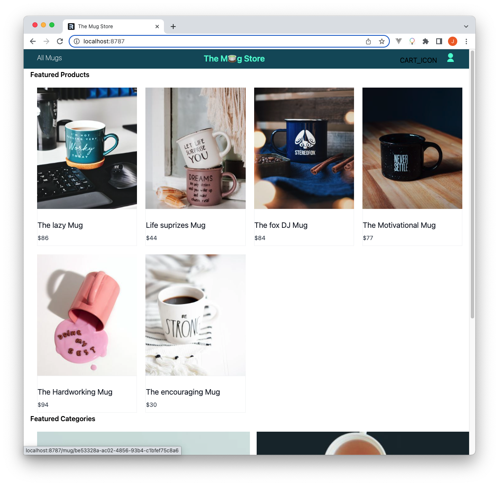
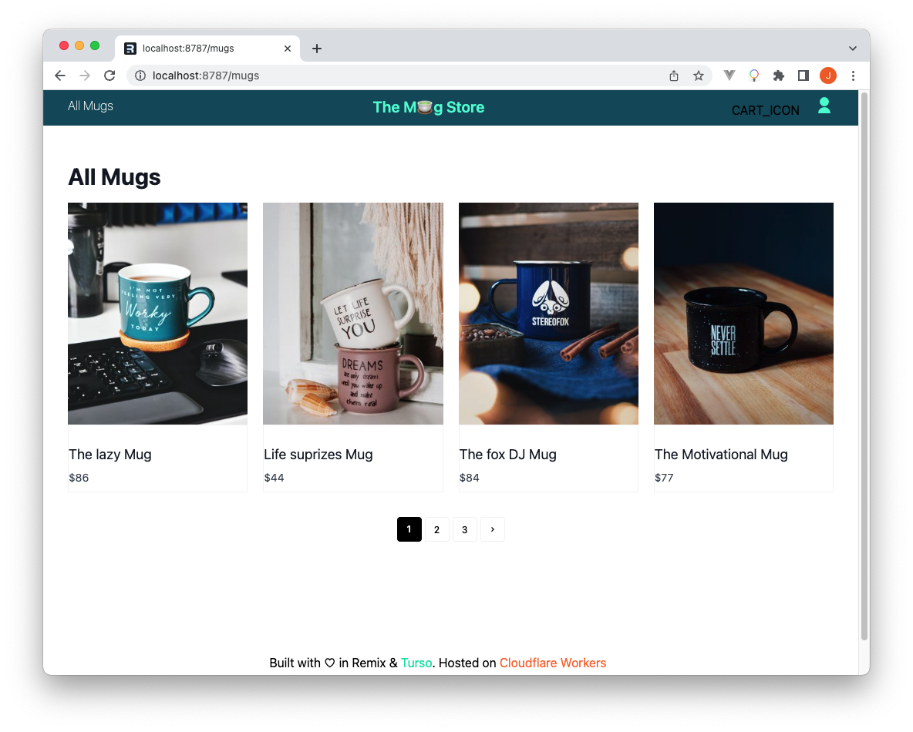

# Step 4: Listing store items

The Mug Store app has two product listing pages, the home page `/` that lists
featured products and categories, and the mugs page `/mugs` that list all mugs
within pages.

## The home page

For the website’s home page we have featured products and categories sections
that in a real-world scenario we’d like to show products based on certain
metrics. For a simple demonstration we’ll just fetch items from the products and
categories table respectively.

Here’s the home page’s [loader] function.

```tsx title="/app/routes/_index.tsx"
export const loader: LoaderFunction = async ({ context }: LoaderArgs) => {
  const db = buildDbClient(context);

  const featuredProducts = await db.query.products.findMany({
    columns: {
      description: false,
      categoryId: false,
    },
  });
  const featuredCategories = await db.query.categories.findMany();

  return {
    featuredProducts: featuredProducts as unknown as Product[],
    featuredCategories: featuredCategories as unknown as Category[],
  };
};
```

We are going to present products using independent cards, hence, add a
`Product.tsx` component under `app/components` with the following code.

```tsx title="/app/components/Product.tsx"
import { resizeImage } from "~/lib/utils";
import type { Product } from "~/lib/types";

export interface ProductCardProps {
  product: Product;
}

export const ProductCard = (props: ProductCardProps) => {
  return (
    <div className="group relative block overflow-hidden">
      <a
        href={`/mug/${props.product.id}`}
        className="group relative block overflow-hidden"
      >
        
      </a>

      <div className="relative border border-gray-100 bg-white py-2">
        <a
          href={`/mug/${props.product.id}`}
          className="group relative block overflow-hidden"
        >
          <h3 className="mt-4 text-lg text-gray-900">{props.product.name}</h3>
        </a>

        <p className="mt-1.5 text-sm text-gray-700">${props.product.price}</p>
      </div>
    </div>
  );
};
```

Here is the code to the `resizeImage()` function imported into the product card
component.

```ts title="/app/lib/utils.ts"
export function resizeImage(url: string, height: number, width: number) {
  return url.replace(/\/v[0-9]+/, `/c_lfill,g_center,h_${height},w_${width}`);
}
```

This utility function placed inside the `app/lib/utils.ts` file simply modifies
the dimensions of the image to be displayed

We can then use the product card to list products throughout the website.

Having added a loader to our home page, we can then consume the data from it
inside the page component by adding the following line of code before the page’s
markup.

```tsx title="/app/routes/_index.tsx"
export default function Index() {
  const { featuredCategories, featuredProducts } =
    useLoaderData<typeof loader>();

  return (); // markup
}
```

Finally, update the page’s markup laying out the product and categories
sections.

```tsx title="/app/routes/_index.tsx"
<div className="flex flex-col space-x-4 space-y-4 px-4">
  <h3 className="font-semibold">Featured Products</h3>

  {featuredProducts.length ? (
    <ul className="mt-4 grid gap-5 sm:grid-cols-3 lg:grid-cols-4 xl:grid-cols-4">
      {featuredProducts.map((product: Product) => (
        <ProductCard {...{ product }} key={product.id} />
      ))}
    </ul>
  ) : (
    <div className="p-4 flex justify-center">
      There are no available products, please check back later!
    </div>
  )}
</div>
```

In the above markup, we are only showing the markup responsible for listing the
featured products. [Open the file on GitHub] to see all of the code.

By the end of these changes, the home page should look like this.



## The product listing page

Inside the mugs page `/mugs` we will be listing all of the products within the
app’s database, breaking down pages using a fixed item count, in this case 20
items per page. Add the following environment variable inside `wrangler.toml` to
set this up.

```toml title="wrangler.toml"
ITEMS_PER_PAGE=20
```

For the page’s pagination, create the dedicated component for that feature by
adding a `Pagination.tsx` file under `app/components`, add the code found within
this file into it.

Create the mugs page by adding a `mugs.($pageNum).tsx` file under `/app/routes`.

Within the mugs page loader function, we are first getting the count of all
items that exist within our database, then use that number to determine the
total number of pages that our data can be grouped into, finally, we return the
items that are expected to be shown within the requested page by checking the
page number `pageNum` param passed in the url.

```tsx title="/app/routes/mugs.($pageNum).tsx"
export const loader: LoaderFunction = async ({
  params,
  context,
}: LoaderArgs) => {
  const db = buildDbClient(context);
  const { pageNum } = params;

  const allProducts = await db.query.products.findMany({
    columns: {
      name: true,
    },
  });

  const itemsCount = allProducts.length;
  const itemsPerPage = context.env?.ITEMS_PER_PAGE || 20;
  const totalPages = Math.ceil((itemsCount as number) / itemsPerPage);
  let currentPage = 1,
    offset = 0;

  if (pageNum !== undefined) {
    currentPage = parseInt(pageNum);
    offset = currentPage === 1 ? 0 : (currentPage - 1) * itemsPerPage;
  }

  const products = await db.query.products.findMany({
    offset: offset,
    limit: itemsPerPage,
  });

  return {
    products: products as unknown as Product[],
    pageInfo: {
      currentPage,
      totalPages,
    },
  };
};
```

Finally, get the products and pagination data from the loader and list the
products within the page’s UI with the pagination component at the bottom.

```tsx title="/app/routes/mugs.($pageNum).tsx"
export default function Mugs() {
  const { products, pageInfo } = useLoaderData<typeof loader>();

  return (
    <>
      {!products.length ? (
        <div className="p-8 flex justify-center">
          There are no available products, please check back later!
        </div>
      ) : (
        <section>
          <div className="mx-auto max-w-screen-xl px-4 py-8 sm:px-6 sm:py-12 lg:px-8">
            <!-- other elements -->
            <ul className="mt-4 grid gap-5 sm:grid-cols-3 lg:grid-cols-4 xl:grid-cols-4">
              {products && products.length ? (
                products.map((product: Product) => (
                  <ProductCard {...{ product }} key={product.id} />
                ))
              ) : (
                <div className="p-8">No items</div>
              )}
            </ul>
            <Pagination {...pageInfo} />
          </div>
        </section>
      )}
    </>
  );
}
```

Here is a presentation of the mugs page with `ITEMS_PER_PAGE` set to 4.



Next, well look into authenticating users so that they can use
the store's guarded features.

[loader]: https://remix.run/docs/en/1.18.1/route/loader
[Open the file on GitHub]: https://github.com/turso-extended/app-the-mug-store/blob/master/app/routes/_index.tsx
[found within this file]: https://github.com/turso-extended/app-the-mug-store/blob/master/app/components/Pagination.tsx
