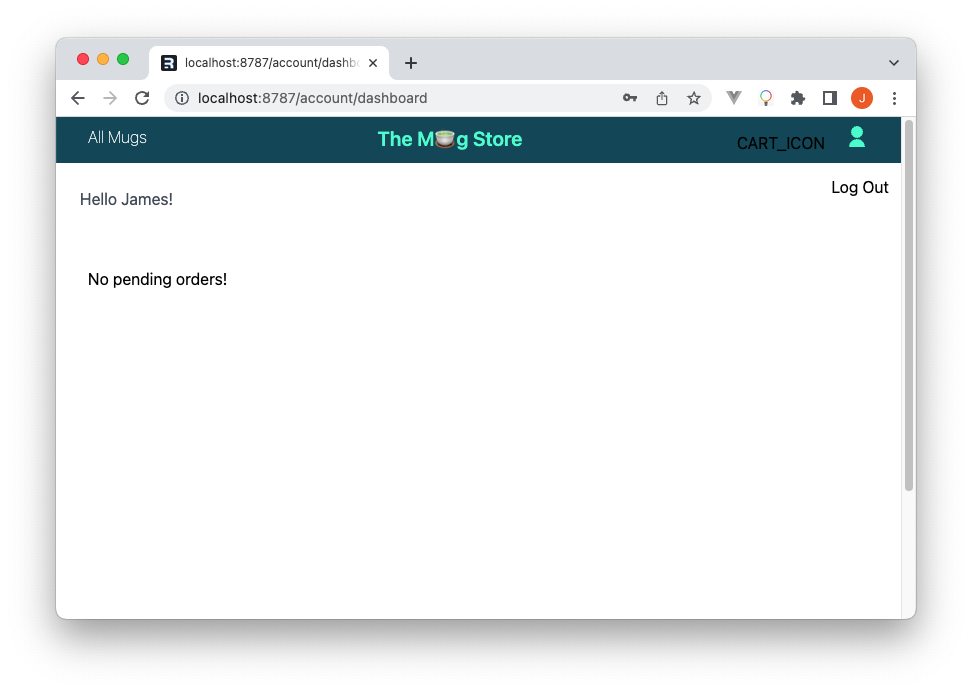

# Step 5: User authentication

All user related features such as the cart and addition of items into it,
placing orders, and checking-out to be added into our Mugs Store app will be
guarded behind an authentication wall. Let’s implement user authentication
within the app before proceeding to working on these features.

We are going to use cookie-based sessions for user authentication within the app
and luckily Remix provides us the `createCookieSessionStorage` helper just for
this.

Create a `session.ts` file inside `/app` and add the following code into it.

```ts title="/app/session.tsx"
import {
  AppLoadContext,
  createCookieSessionStorage,
} from "@remix-run/cloudflare";

type SessionData = {
  userId: string;
};

type SessionFlashData = {
  error: string;
};

export function cookieSessionCreation(context: AppLoadContext) {
  const { getSession, commitSession, destroySession } =
    createCookieSessionStorage<SessionData, SessionFlashData>({
      // a Cookie from `createCookie` or the CookieOptions to create one
      cookie: {
        name: "__session",
        httpOnly: true,
        maxAge: 7 * 60 * 60,
        path: "/",
        sameSite: "lax",
        secrets: [context.env?.SESSION_SECRET],
        secure: true,
      },
    });

  return { getSession, commitSession, destroySession };
}
```

The `createCookieSessionStorage` function provides us with utility functions that
enable us to manage cookie sessions within our Remix app. For the `SESSION_SECRET`
we are using a randomly generated string which we then store as a secret
environment variable just as we did with the database auth token previously.

The next step would be the addition of the registration and login pages. Start
by creating two files `account.login.tsx` and `account.register.tsx` inside the
`app/routes` directory.

We are going to hash user passwords before storing them to our database using
bcrypt, hence, install the `bcrypt` npm package to our app by running the
following command.

```sh
npm install bcryptjs
```

## User registration

Within the [user registration page] `/account.login.tsx` we’ll simply be submitting
user information to a page action that takes care of form data validation,
storage of the data to the database, and redirection of the user to the login
page when correct information is provided, otherwise it will give us an error
message.

Create a dedicated utility file that will handle the session logic for the user
authentication flow within our app. Name the file `session.server.ts` and place it
under `app/lib`.

Within this file, we’ll add the user registration function [`register()`] that
validates the user data being submitted to the database via the registration
page action and creates new records or returns coherent error messages back to
the registration page.

Then, import and use the `register()` function [within the page action].

You can view all of the user registration page code [on GitHub].

## Authenticating users

To authenticate users, add a `login()` function inside the
`app/lib/session.server.ts` file which will handle the assessment of the user’s
auth credentials submitted through the login page form and the initialization of
an authenticated session.

Here’s the code for the `login()` function.

```ts title="/app/lib/session.server.ts"
export interface LoginCredentials {
  email: string;
  password: string;
}

export async function login(
  { email, password }: LoginCredentials,
  serverContext: AppLoadContext
) {
  const db = buildDbClient(serverContext);
  const user = await db.query.users.findFirst({
    where: (users, { eq }) => eq(users.email, email),
    with: {
      password: true,
    },
  });

  if (user !== undefined) {
    const isValidPassword = bcrypt.compareSync(
      password,
      user.password.hash
    );

    return !isValidPassword ? null : user;
  }

  return null;
}
```

Next, create another utility function that will handle the creation of a
successfully authenticated user’s session leveraging the
`cookieSessionCreation()` helper we created earlier. Add the following function
inside the `app/lib/session.server.ts` file.

```ts title="/app/lib/session.server.ts"
export async function createUserSession(
  userId: string,
  redirectUrl: string,
  serverContext: AppLoadContext
) {
  const { getSession, commitSession } = cookieSessionCreation(serverContext);
  const session = await getSession();
  session.set("userId", userId);

  return redirect(redirectUrl, {
    headers: {
      "Set-Cookie": await commitSession(session),
    },
  });
}
```

We can then import and use these two functions within [the login page’s action]
as follows to fully implement user authentication.

```ts title="/app/routes/account.login.ts"
const user = await login(values as unknown as LoginCredentials, context);
if (!user)
  return json(
    { ok: false, message: "Wrong credentials!" },
    { status: 400, statusText: "Wrong credentials!" }
  );

return createUserSession(user.id, "/account/dashboard", context);
```

Then, inside the page component we can initiate a new [Fetcher] and create a
login form as follows.

```tsx title="/app/routes/account.login.ts"
const loginFetcher = useFetcher();
return (
  <loginFetcher.Form method="post">
    <div>
      <input name="email" type="email" required />
    </div>
    <div>
      <input name="password" type="password" required />
    </div>
    <div>
      <button type="submit"> Sign in </button>
    </div>
    <div className="py-2">
      <a href="/account/register" className="font-thin">
        Create an account
      </a>
    </div>
  </loginFetcher.Form>
);
```

You can view the complete login page code on GitHub.

## Adding authentication page guards

Since the pages we are going to add next need authenticated user access, we’ll
need to redirect any unauthenticated access attempts to the log-in page. Create
a `requireUseId()` function inside `lib/session.server.ts` that will check to
see if an authenticated session exists, if not it will redirect the user to the
log-in page.

```ts title="/app/lib/session.server.ts"
export async function requireUserId(
  {
    request,
    redirectTo = new URL(request.url).pathname,
  }: {
    request: Request;
    redirectTo?: string;
  },
  serverContext: AppLoadContext
) {
  const { getSession } = cookieSessionCreation(serverContext);
  const session = await getSession(request.headers.get("Cookie"));
  const userId = session.get("userId");
  if (!userId) {
    const searchParams = new URLSearchParams([["redirectTo", redirectTo]]);
    redirect(`/account/login?${searchParams}`);
  }
  return userId;
}
```

We can then import and call this function at the top of the loader functions of
all the pages we want to guard against unauthorized access.

```tsx title="Code to add to the loaders of all guarded pages"
import { requireUserId } from "~/lib/session.server";

export async function loader({ request, context }: LoaderArgs): Promise<any> {
  const db = buildDbClient(context);
  const userId = await requireUserId(
    { request, redirectTo: "/account/login" },
    context
  );
  if (userId === undefined) {
    return redirect("/account/login");
  } else {
    // The rest of the page's loader logic
  }
}
```

## The user dashboard and logging out

We are going to add a user dashboard where at the very minimum the user's order
history will be listed.

Also, we need to be able to log the authenticated users out of our app, and we
are going to implement this feature right in the dashboard page.

Since we’ve set up Drizzle schema relations, getting the orders based on a user
is a very easy task, all we need to do is perform a [findFirst] query on the
users table listing the users orders in the returned data.

Create an `accounts.dashboard.tsx` page inside `app/routes` and within the
page’s loader, query and return the user’s details as follows.

```tsx title="/app/routes/accounts.dashboard.tsx"
const user = await db.query.users.findFirst({
  where: (users, { eq }) => eq(users.id, userId),
  with: {
    orders: true,
  },
});
return { user };
```

We can then get this data in the dashboard page component and list the user’s
orders as follows.

```tsx title="/app/routes/account.dashboard.tsx"
const { user } = useLoaderData<typeof loader>();

return (
	<table>
	  <thead>
      <th>Date</th> th>Total Cost</th> <th>Shipping to</th>
	  </thead>
	  <tbody>
	    {user.orders.map((order: Order) => (
	      <tr key={order.id}>
	        <td>
	          {formatDate(order.orders.createdAt)}
	        </td>
	        <td>
	          {order.orders.finalAmount}$
	        </td>
	        <td>
	          {order.orders.shippingAddress}
	        </td>
	      </tr>
	    ))}
	  </tbody>
	</table>
)
```

The `formatDate()` function called in the above code is simply a date formatting
utility function exported from the `app/lib/utils.ts`.

```ts title="/app/lib/utils.ts"
export function formatDate(date: number) {
  const day = new Date(date * 1000);

  const formattedDate = Intl.DateTimeFormat("en-US", {
    day: "numeric",
    month: "short",
    year: "numeric",
  }).format(day);

  return formattedDate;
}
```

To log users out, add the following page action to `account.dashboard.tsx` file.

```tsx title="/app/routes/account.dashboard.tsx"
export const action: ActionFunction = async ({
  request,
  context,
}: ActionArgs) => {
  const userId = await requireUserId(
    { request, redirectTo: "/account/login" },
    context
  );
  if (userId !== undefined) {
    return destroyUserSession(userId, "/account/login", context);
  }
};
```

Within this loader function, we are simply destroying the previously created
user authenticated session.

Add a fetcher form to trigger this action inside the page.

```ts
const logOutFetcher = useFetcher();
return (
  <!-- other markup -->
    <logOutFetcher.Form method="post">
      <button type="submit" className="p-3">Log Out</button>
    </logOutFetcher.Form>
  <!-- other markup -->
)
```

Create some users to test this part of the website and verify if everything
works.

Here is what the user dashboard should look like when opened after a user is
authenticated.



After having set up user authentication we can then proceed to adding the pages
and features that are dependent on it.

[`createCookieSessionStorage`]: https://remix.run/docs/en/1.18.1/utils/sessions#createcookiesessionstorage
[user registration page]: https://github.com/turso-extended/app-the-mug-store/blob/master/app/routes/account.register.tsx
[`register()`]: https://github.com/turso-extended/app-the-mug-store/blob/master/app/lib/session.server.ts#L50-L117
[within the page action]: https://github.com/turso-extended/app-the-mug-store/blob/master/app/routes/account.register.tsx#L12
[on GitHub]: https://github.com/turso-extended/app-the-mug-store/blob/master/app/routes/account.register.tsx
[the login page’s action]: https://github.com/turso-extended/app-the-mug-store/blob/master/app/routes/account.login.tsx#L13
[Fetcher]: https://remix.run/docs/en/1.18.1/hooks/use-fetcher
[findFirst]: https://orm.drizzle.team/docs/rqb#find-first
