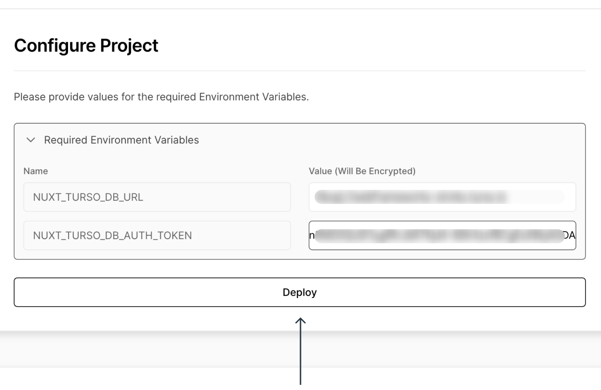
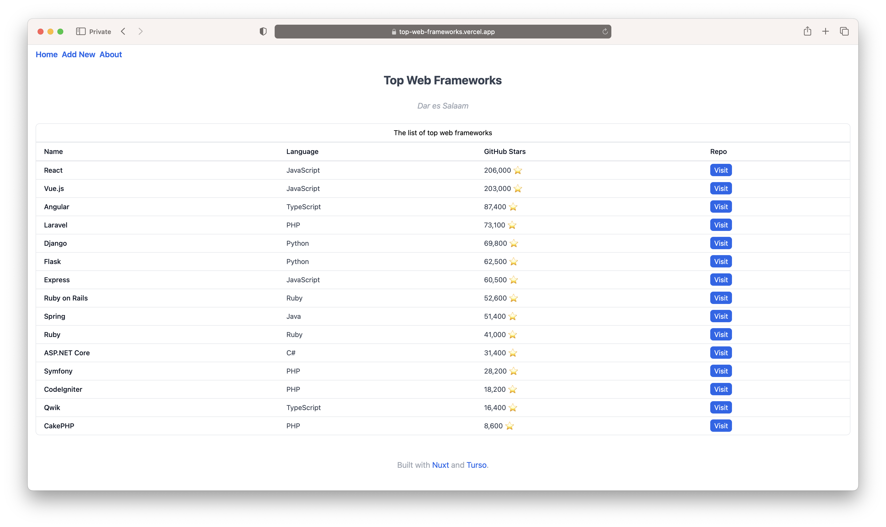
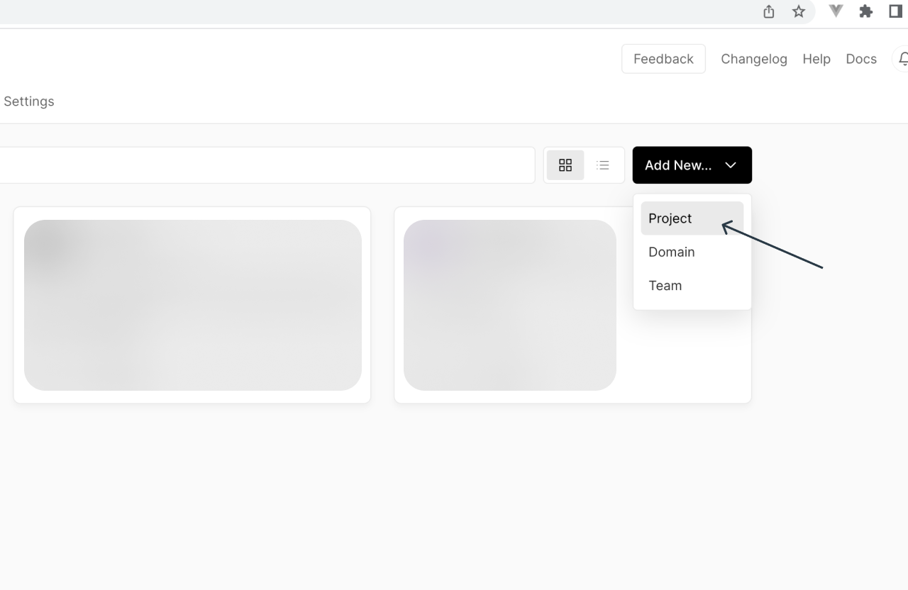
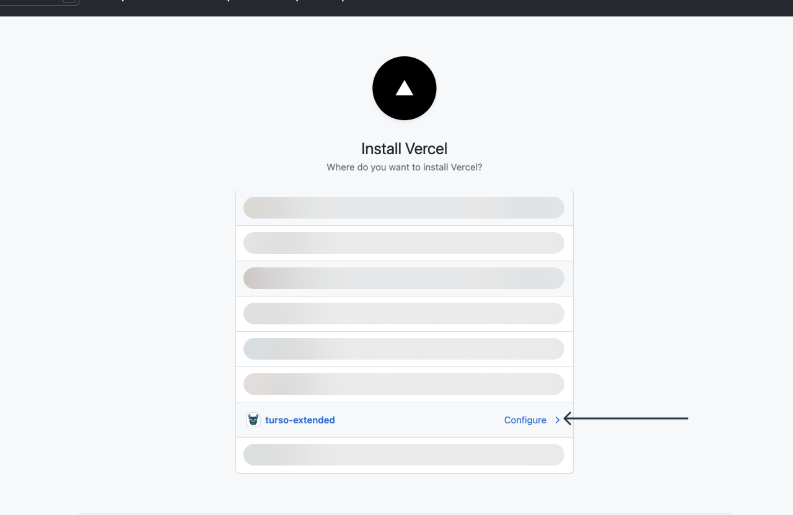
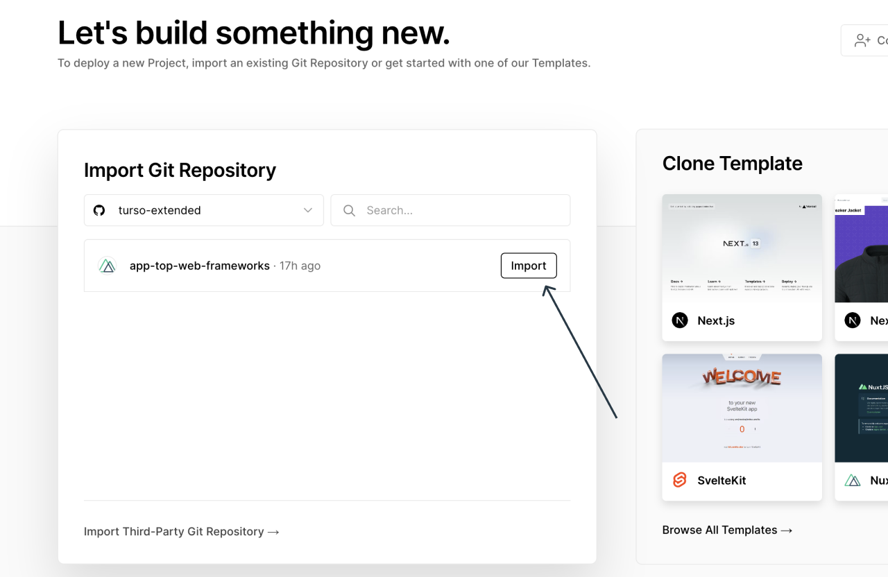
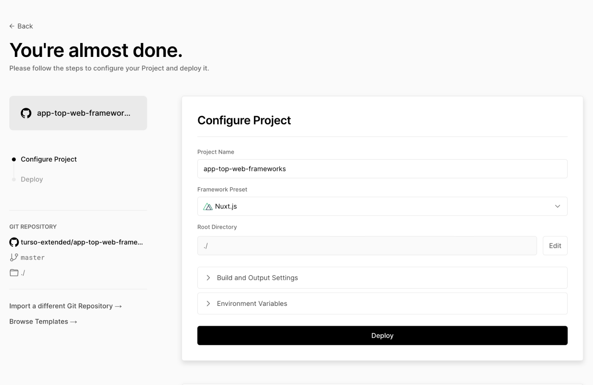
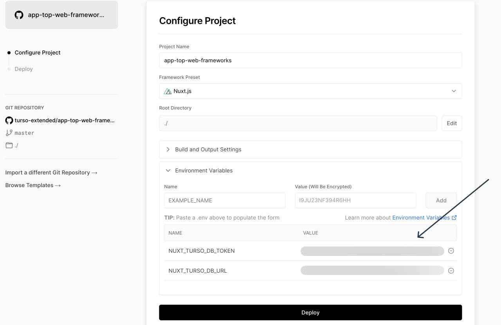
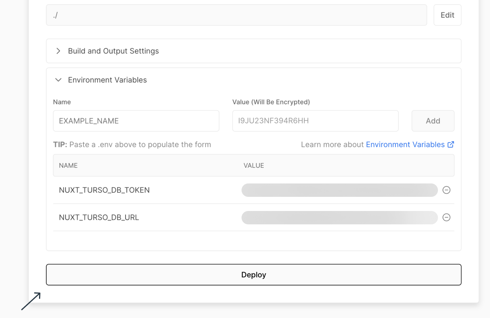
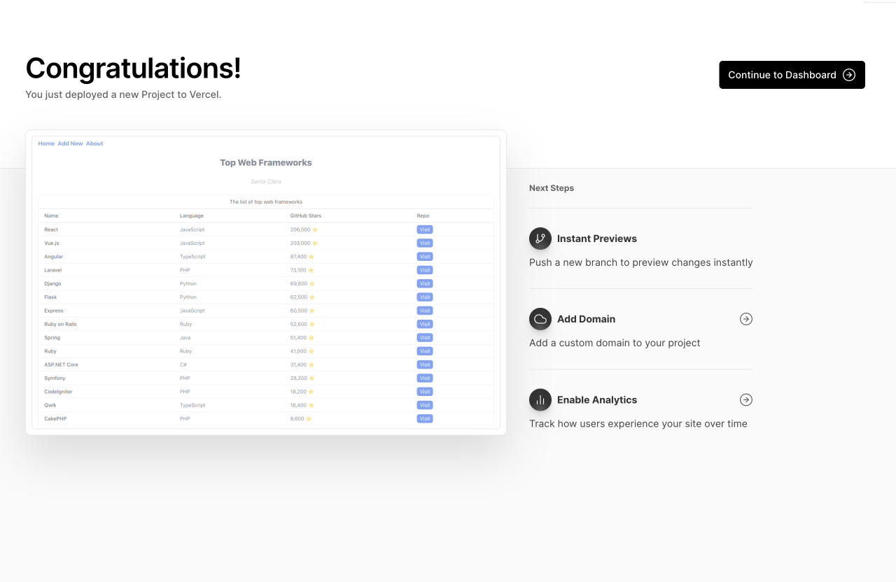

# Vercel setup guide

In this setup guide, we are deploying a web application made in [Nuxt] that’s
using [Turso] as its database.

The project being deployed is available on this [GitHub repo].

## Prerequisites

1. [A Vercel account].
2. The Turso CLI installed in your machine ([installation instructions]).

## 1. Set up the Turso database

### 1a. Create a new database

Run the following CLI command:

```bash
turso db create topwebframeworks
```

### 1b. Access the database using the shell.

Run the following CLI command

```bash
turso db shell topwebframeworks
```

### 1c. Define and populate the database

Copy and paste the following SQL statements to the shell to create tables,
indexes, and seed the database with sample data.

```sql
-- create frameworks table
create table frameworks (
    id integer primary key,
    name varchar (50) not null,
    language varchar (50) not null,
    url text not null,
    stars integer not null
);

-- "name" column unique index
create unique index idx_frameworks_name on frameworks (name);

-- "url" column unique index
create unique index idx_frameworks_url on frameworks (url);

-- seed some data
insert into frameworks(name, language, url, stars) values("Vue".js , "JavaScript", "<https://github.com/vuejs/vue>", 203000);
insert into frameworks(name, language, url, stars) values("React", "JavaScript", "<https://github.com/facebook/react>", 206000);
insert into frameworks(name, language, url, stars) values("Angular", "TypeScript", "<https://github.com/angular/angular>", 87400);
insert into frameworks(name, language, url, stars) values("ASP.NET Core", "C#", "<https://github.com/dotnet/aspnetcore>", 31400);
insert into frameworks(name, language, url, stars) values("Express", "JavaScript", "<https://github.com/expressjs/express>", 60500);
insert into frameworks(name, language, url, stars) values("Django", "Python", "<https://github.com/django/django>", 69800);
insert into frameworks(name, language, url, stars) values("Ruby on Rails", "Ruby", "<https://github.com/rails/rails>", 52600);
insert into frameworks(name, language, url, stars) values("Spring", "Java", "<https://github.com/spring-projects/spring-framework>", 51400);
insert into frameworks(name, language, url, stars) values("Laravel", "PHP", "<https://github.com/laravel/laravel>", 73100);
insert into frameworks(name, language, url, stars) values("Flask", "Python", "<https://github.com/pallets/flask>", 62500);
insert into frameworks(name, language, url, stars) values("Ruby", "Ruby", "<https://github.com/ruby/ruby>", 41000);
insert into frameworks(name, language, url, stars) values("Symfony", "PHP", "<https://github.com/symfony/symfony>", 28200);
insert into frameworks(name, language, url, stars) values("CodeIgniter", "PHP", "<https://github.com/bcit-ci/CodeIgniter>", 18200);
insert into frameworks(name, language, url, stars) values("CakePHP", "PHP", "<https://github.com/cakephp/cakephp>", 8600);
insert into frameworks(name, language, url, stars) values("Qwik", "TypeScript", "<https://github.com/BuilderIO/qwik>", 16400);
```

### 1d. Quit the shell

Type the following at the shell prompt to terminate the shell:

```sql
.quit
```

## 2. Deploy the app to Vercel

### 2a. Start a guided installation

Click this button to start a guided deployment. It will copy the app’s source
code into your GitHub and deploy it from there.

[](https://vercel.com/new/clone?repository-url=https%3A%2F%2Fgithub.com%2Fturso-extended%2Fapp-top-web-frameworks&env=NUXT_TURSO_DB_URL,NUXT_TURSO_DB_AUTH_TOKEN)

:::note

If you would prefer to fork and deploy the source repo and configure the
deployment manually, follow the [manual installation
instructions](#alternative-manual-deployment) at the end of this page. The
following instructions assume that you're using the above button to perform the
deployment.

:::

### 2b: Create a copy of the GitHub repository

Vercel will create a copy of the GitHub repository containing the project’s
source to your GitHub account to facilitate continuous integration.


After filing up the project’s name and selecting the Git scope, click create to
proceed.

### 2c: Provide the values for the project’s environment variables

The app (Top Web Frameworks) requires two environment variables to facilitate
the connection to the database created earlier: `NUXT_TURSO_DB_URL` and
`NUXT_TURSO_DB_AUTH_TOKEN`.

These values are required by the [libSQL TypeScript client] SDK to initialize
the client and connect to the Turso database.



Vercel prompts you for these variables after you complete the previous step.

#### Get the value for `NUXT_TURSO_DB_URL`

Run the following CLI command:

```bash
turso db show topwebframeworks --url
```

It outputs the URL for the database. Copy that string into the
`NUXT_TURSO_DB_URL` variable.

#### Get the value for `NUXT_TURSO_DB_AUTH_TOKEN`

Run the following CLI command:

```bash
turso db tokens create topwebframeworks -e none
```

It outputs a non-expiring authentication token that allows the libSQL client
library used by the app to connect to the database. The `-e` flag in the command
is the short for `--expiration`.

Copy the resulting string into the `NUXT_TURSO_DB_AUTH_TOKEN` variable.

#### Deploy the app.

Click the “Deploy” button to finalise the project’s deployment.

When the project completes deploying, you’ll be redirected to the project
deployment’s congratulatory page seen below.


## 3. Verify the app works

In step 1, you  created and seeded the database with some data. You can view the
deployed app by clicking the project’s screenshot at the end of step 2 to view
the seeded data and verify that the app is correctly connected to Turso.



Here onwards, Vercel will automate continuous deployments whenever you push to
the created git repository’s production branch unless this setting is manually
disabled.

## (Alternative) manual deployment

To manually set up your project for deployment on Vercel, without the help of
the “Vercel deploy button” in step 2, you can instead use the Vercel dashboard
to manually pick your GitHub repo and configure its environment variables.

The following instructions will walk you through this process using the same
source repository.

### 1. Fork the repo

Visit [the project on
GitHub](https://github.com/turso-extended/app-top-web-frameworks) and fork the
repository to your account.

### 2. Add a new project on your Vercel dashboard

Open your Vercel dashboard, select “Add New”, and pick “Project”.



### 3. Authorise Vercel

If you’ve not authorised Vercel on your GitHub account you’ll be requested to
provide such access.



Likewise, at the repository level.


### 4. Pick your GitHub repository

Next, pick the forked GitHub repository and import it.



### 5. Configure the site settings

Set the site settings for your project on Vercel, including the project’s name,
build, and output configurations. (For most frameworks, as is the case here,
Vercel auto-detects and populates the default configuration for the project.)



### 6. Configure the app’s environment variables

The app (Top Web Frameworks) requires two environment variables to facilitate
the connection to the database created earlier: `NUXT_TURSO_DB_URL` and
`NUXT_TURSO_DB_AUTH_TOKEN`.

Expand the “Environment Variables” section on the site settings page.

These values are required by the [libSQL TypeScript client] SDK to initialize
the client and connect to the Turso database.

#### 6a. Create an environment variable for `NUXT_TURSO_DB_URL`

On the available environment section fields, add `NUXT_TURSO_DB_URL` as a new
environment key.

Run the following CLI command:

```bash
turso db show topwebframeworks --url
```

It outputs the URL for the database. Copy that string into the
`NUXT_TURSO_DB_URL` variable, and click the “Add” button.

#### 6b. Create an environment variable for `NUXT_TURSO_DB_AUTH_TOKEN`

Add `NUXT_TURSO_DB_AUTH_TOKEN` as a new environment key.

Run the following CLI command:

```bash
turso db tokens create topwebframeworks -e none
```

It outputs a non-expiring authentication token that allows the libSQL client
library used by the app to connect to the database. The `-e` flag in the command
is the short for `--expiration`.

Copy the resulting string into the `NUXT_TURSO_DB_AUTH_TOKEN` variable, and
click the “Add” button.



### 7. Deploy the site



After the deployment is completed, you’ll be directed to a congratulatory page
like the one below.



### 8. Preview the site after deployment

Click the site preview screenshot on the previous step to see the deployed site.


[Turso]: https://turso.tech
[Nuxt]: https://nuxt.com
[GitHub repo]: https://github.com/turso-extended/app-top-web-frameworks
[A Vercel account]: https://app.netlify.com/signup
[installation instructions]: https://docs.turso.tech/reference/turso-cli#installation
[libSQL TypeScript client]: https://github.com/libsql/libsql-client-ts/